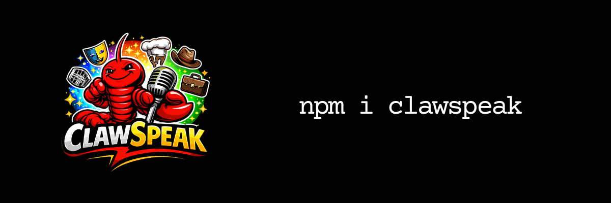

<p align="center">
  
</p>

# ClawSpeak 🦞


**Tone-only voice overlays for agent outputs. Draft → ClawSpeak → final.**

## Introduction

ClawSpeak rewrites text into a selected local voice or persona. Meaning, safety, and capabilities stay unchanged—only tone and style change. It works with OpenAI, Grok (xAI), and any OpenAI-compatible provider. Ship it as an NPM package or as an OpenClaw plugin.

## 20-Second Demo

```ts
import { createVoicedTextAgent, openAICompatAdapter } from "clawspeak";

const adapter = openAICompatAdapter({
  apiKey: process.env.OPENAI_API_KEY,
  model: "gpt-4.1-mini"
});

const baseAgent = async (input) => {
  return "Explain what staking is in simple terms.";
};

const glasgowAgent = createVoicedTextAgent({
  agent: baseAgent,
  voiceId: "glaswegian",
  model: adapter
});

console.log(await glasgowAgent(""));
```

## What It Does

- **Deterministic tone rewrite** — Same input and voice yield consistent style.
- **Preserves meaning** — No new facts, no dropped content.
- **Slang cap enforcement** — Per-voice limits; metadata reports overuse.
- **Anti-caricature guardrails** — Flags heavy phonetic spelling and banned phrases.
- **Clarity heuristics** — Optional warnings for long sentences or complex wording.
- **Provider-agnostic** — OpenAI, Grok (xAI), and any OpenAI-compatible API.
- **Multiple regional and stylistic voices** — Including blunt and ultra-polite modes.

## Voices

- east_end_londoner
- scouse
- glaswegian
- geordie
- dublin
- new_yorker
- texan
- southern_us
- californian
- overly_polite
- very_rude
- raig_bait_chef

Voices are designed to remain broadly understandable, avoid stereotypes, and preserve meaning exactly.

Use `listVoices()` for labels and descriptions.

## Install

```bash
npm i clawspeak
```

## Usage (OpenAI)

```ts
import { listVoices, applyVoice, openAICompatAdapter } from "clawspeak";

const adapter = openAICompatAdapter({
  apiKey: process.env.OPENAI_API_KEY,
  model: "gpt-4.1-mini",
  baseUrl: "https://api.openai.com/v1"
});

const res = await applyVoice({
  text: "Explain this in 3 bullet points.",
  voiceId: "glaswegian",
  model: adapter,
  options: { strength: 0.55, returnMetadata: true }
});

console.log(res.text);
console.log(res.meta);
```

## Usage (Grok / xAI)

Same API; swap base URL and model:

```ts
const adapter = openAICompatAdapter({
  apiKey: process.env.XAI_API_KEY,
  model: "grok-2-latest",
  baseUrl: "https://api.x.ai/v1"
});

const res = await applyVoice({ text: "...", voiceId: "dublin", model: adapter });
console.log(res.text);
```

## Local voice testing (no OpenClaw required)

ClawSpeak is a tone-only post-processing layer.
It requires a `ModelAdapter` because rewrites are performed by an LLM.

You can test voices locally without OpenClaw using the OpenAI-compatible adapter.

### 1. Install and build

```bash
pnpm install
pnpm --filter clawspeak build
```

### 2. Set your API key

```bash
export LLM_API_KEY="sk-..."
```

Optional environment variables:

```bash
export LLM_MODEL="gpt-4o-mini"
export LLM_BASE_URL="https://api.openai.com/v1"
```

### 3. Run the local test harness

```bash
node scripts/test-raig.mjs
```

This will:

- Print available voices
- Rewrite sample text using raig_bait_chef
- Output guardrail metadata

### Direct usage example

```ts
import {
  applyVoice,
  openAICompatAdapter
} from "clawspeak";

const model = openAICompatAdapter({
  apiKey: process.env.LLM_API_KEY!,
  model: "gpt-4o-mini"
});

const result = await applyVoice({
  text: "Explain what this library does.",
  voiceId: "raig_bait_chef",
  model,
  options: { strength: 0.8 }
});

console.log(result.text);
```

ClawSpeak modifies tone only.
It does not alter meaning, safety boundaries, or factual content.

## OpenClaw Plugin

The **@clawspeak/openclaw** plugin exposes ClawSpeak as tools for OpenClaw-compatible agents:

- **clawspeak_list** — List available voices.
- **clawspeak_apply** — Rewrite text into a voice.
- **clawspeak_preview** — Preview a voice on sample text.

The plugin ships with a **SKILL.md** so agents know when and how to use the overlay. See `packages/openclaw` and [packages/openclaw/README.md](packages/openclaw/README.md).

## Repo Structure

```
packages/clawspeak   — Core library (voices, adapter, guardrails, createVoicedAgent)
packages/openclaw    — OpenClaw plugin + Skill
examples/node-basic  — Minimal Node example with .env
```

## License

MIT
